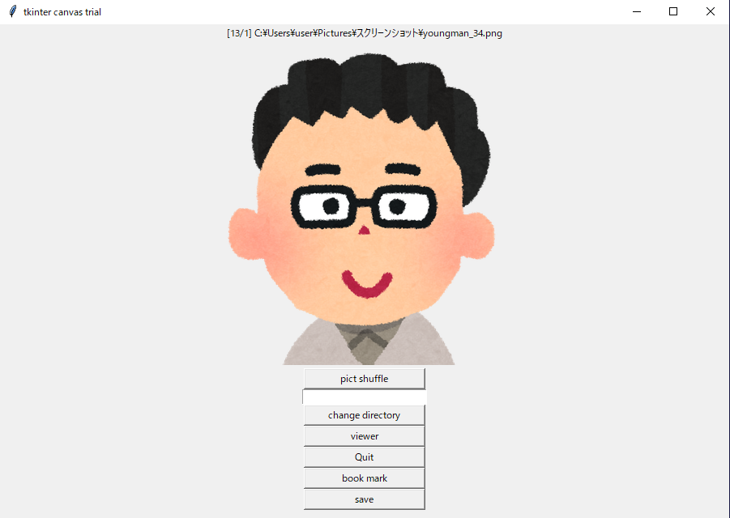

# 簡単な画像ザッピングツール

## 動作確認

|      |     |
|------|-----|
|Python|3.8.1|
|Tk    |8.6  |
|Pillow|7.0.0|

## 機能

 - ランダムに画像ファイルを表示する。
 - 表示する画像ファイルをシャッフルする。
 - ディレクトリを移動できる。
 - ブックマーク機能で好きな画像だけをシャッフルできる。

## 使い方

        $ python random_viewer.py [something_dir]

お好きなディレクトリをシェルで開き、そこからこのスクリプトを起動してください。引数なしの場合カレントディレクトリの画像を表示します。

### 高度な機能

このプログラムはセットリストとレジスタの2つのリストを記憶しています。

セットリストは "pict shuffle" で表示される画像のパスのリストです。デフォルトではカレントディレクトリをセットリストにします。

"load"ボタン、"b"キーで bookmark.ini をセットリストにできます。

レジスタは "save" で bookmark.ini としてダンプされる画像のパスのリストです。"book mark"ボタン、"y"キー,"Y"キーで現在の画像のパスを追加できます。

### ボタン操作

- pict shuffle
    - 表示している画像をランダムに変更します。
- change directory
    - テキストボックスに開きたいディレクトリの絶対パスを入れて "change directory" をクリック
- book mark
    - 現在の画像をレジスタに入れ、ランダムに画像を変更する。
- save
    - レジスタの内容をブックマークファイル(bookmark.ini)としてダンプする。
- load
    - セットリストをブックマークファイル(bookmark.ini)の内容にする。
- viewer
    - 現在の画像を別のビューワーで開く。
- Quit
    - 終了する。

### キーボードショートカット

- "b"
    - ブックマ－ク呼び出し。ブックマークファイルの画像を表示します。
- "v"
    - viewer で開く。
- "q"
    - random_viewer を終了する。
- "y"
    - レジスタに画像のパスを渡し。セットリストからパスを削除する。
- "Y"
    - レジスタにセットリストの画像のパスを渡す。
- "x"
    - セットリストからパスを削除する。
- "Return"
    - 画像シャッフル

